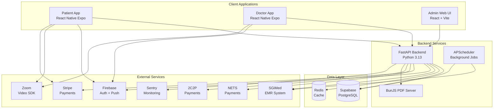
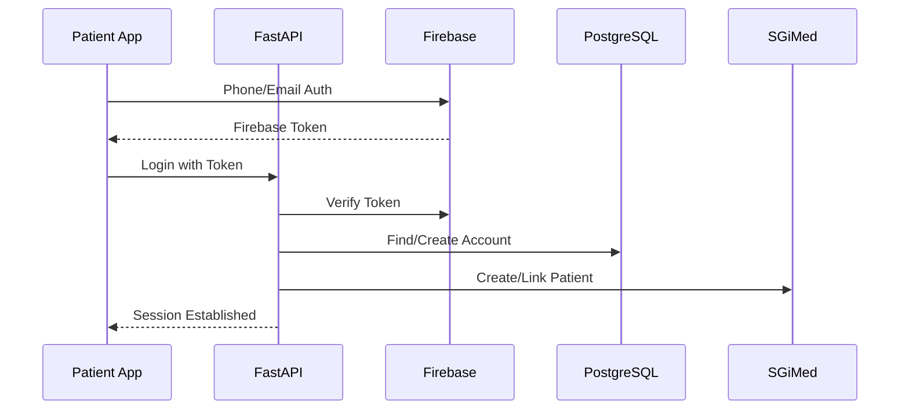
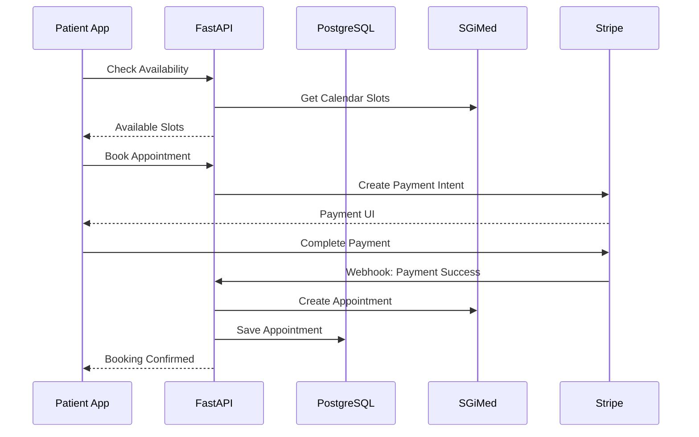
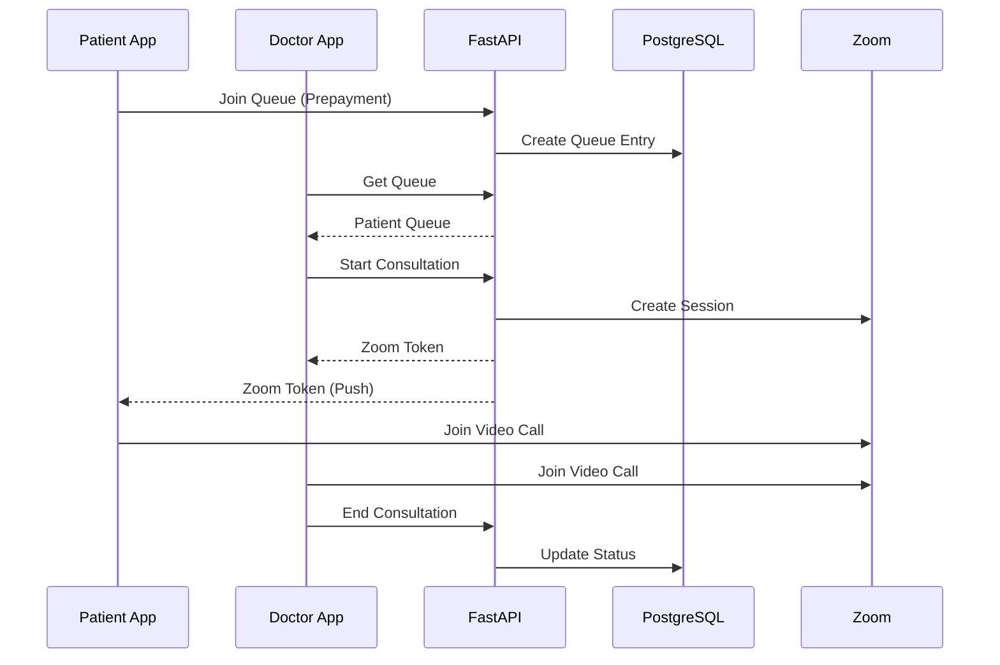

# PinnacleSG Platform Overview

This document provides a high-level overview of the PinnacleSG medical/telemedicine platform architecture.

## Platform Summary

PinnacleSG is a comprehensive healthcare platform serving Pinnacle Family Clinic in Singapore. The platform enables:

- **Patient mobile app**: Appointment booking, teleconsultation, health records access
- **Doctor mobile app**: Video consultations, patient queue management
- **Admin web portal**: Clinic operations, patient management, reporting

## Architecture Diagram



## Monorepo Structure

```
pinnaclesg-monorepo/
├── backend-patient-app/      # FastAPI backend (Python 3.13)
├── backend-bunjs-server/     # Bun.js PDF generation service
├── frontend-patient-app/     # React Native Expo patient mobile app
├── frontend-doctor-app/      # React Native Expo doctor mobile app
├── frontend-admin-web-ui/    # React + Vite admin dashboard
├── scripts/                  # Monorepo tooling scripts
├── documentation/            # Project documentation
└── openapi.json              # Generated API specification
```

## Technology Stack

### Backend
| Component | Technology | Purpose |
|-----------|------------|---------|
| Runtime | Python 3.13 | Server runtime |
| Framework | FastAPI | REST API framework |
| ORM | SQLAlchemy 2.x | Database ORM |
| Validation | Pydantic v2 | Request/response validation |
| Migrations | Alembic | Database migrations |
| Scheduler | APScheduler | Background job processing |
| Real-time | Broadcaster | WebSocket broadcasting |

### PDF Generation Service
| Component | Technology | Purpose |
|-----------|------------|---------|
| Runtime | Bun.js | Fast JavaScript runtime |
| PDF Library | @react-pdf/renderer | React-based PDF generation |
| Output | Health Reports | Patient health screening PDFs |

### Frontend (Mobile)
| Component | Technology | Purpose |
|-----------|------------|---------|
| Framework | React Native 0.76 | Cross-platform mobile |
| Platform | Expo ~52.0 | Development platform |
| Routing | Expo Router | File-based navigation |
| State | TanStack Query | Server state management |
| Styling | NativeWind | Tailwind for RN |
| Video | Zoom Video SDK | Video consultations |

### Frontend (Web)
| Component | Technology | Purpose |
|-----------|------------|---------|
| Framework | React 18.3 | Web UI framework |
| Build | Vite 5.4 | Build tool |
| Routing | React Router v6 | SPA navigation |
| UI Library | Ant Design 5.x | Component library |
| Styling | Tailwind CSS | Utility-first CSS |

### Infrastructure
| Component | Technology | Purpose |
|-----------|------------|---------|
| Database | Supabase (PostgreSQL) | Primary data store |
| Auth | Firebase / Supabase | User authentication |
| Cache | Redis | Session and data caching |
| Hosting | Render | Backend deployment |
| Monitoring | Sentry | Error tracking |

## Key Integrations

### SGiMed (Electronic Medical Records)
Master healthcare system integration for:
- Patient profile synchronization
- Appointment management
- HL7 health record processing
- Invoice and billing data

### Payment Gateways
- **Stripe**: Primary payment processor (cards, PayNow)
- **NETS Click/QR**: Local Singapore payment methods
- **2C2P**: Regional payment gateway

### Communication
- **Firebase**: Push notifications, mobile authentication
- **SMSDome**: OTP delivery for phone verification
- **Zoom Video SDK**: Teleconsultation video calls

## Data Flow

### Patient Registration Flow


### Appointment Booking Flow


### Teleconsult Flow


## Security Model

### Authentication
- **Patient App**: Firebase Authentication (Phone OTP, Email)
- **Doctor App**: Supabase Authentication + Firebase
- **Admin Web**: Supabase Authentication (Email/Password)

### Authorization
- Role-based access control (RBAC)
- Roles: SUPERADMIN, ADMIN, DOCTOR, LOGISTIC, DISPATCH
- JWT tokens for API authentication
- Webhook signature verification for integrations

### Data Protection
- HTTPS for all communications
- Secrets managed via Infisical (no .env files)
- Database connection pooling with SSL
- PII handling compliant with Singapore PDPA

## Development Workflow

### Local Development
```bash
# Backend
cd backend-patient-app
infisical run --env=staging -- uvicorn main:app --reload

# Frontend (Mobile)
cd frontend-patient-app
pnpm start

# Frontend (Web)
cd frontend-admin-web-ui
pnpm dev
```

### API Client Generation
```bash
# Generate OpenAPI spec
cd backend-patient-app && uvicorn main:app  # Start server

# Generate clients
cd frontend-patient-app && pnpm run gen-client
cd frontend-admin-web-ui && pnpm run gen-client
```

### Deployment
- **Monorepo**: Push to `main` triggers GitHub Actions
- **Sync**: Changes sync to individual repositories
- **Deploy**: Render auto-deploys from synced repos

## Documentation Index

| Document | Description |
|----------|-------------|
| [01-db-schema.md](./01-db-schema.md) | Database schema and ERD diagrams |
| [02-application-guides.md](./02-application-guides.md) | Developer workflows and patterns |
| [03-stack-details.md](./03-stack-details.md) | Technology stack versions |
| [04-api-documentation.md](./04-api-documentation.md) | API endpoint reference |
| [05-external-integrations.md](./05-external-integrations.md) | External system integrations |
| [06-credentials-document.md](./06-credentials-document.md) | Secrets management |
| [07-backend-architecture.md](./07-backend-architecture.md) | Backend code structure |
| [08-frontend-architecture.md](./08-frontend-architecture.md) | Frontend app structure |
| [09-testing-quality.md](./09-testing-quality.md) | Testing and code quality |
| [10-deployment-environments.md](./10-deployment-environments.md) | Deployment and environments |
| [11-troubleshooting.md](./11-troubleshooting.md) | Common issues and solutions |
| [monorepo-sync-setup.md](./monorepo-sync-setup.md) | Repository sync configuration |

---

**Last Updated**: 2026-01-16
