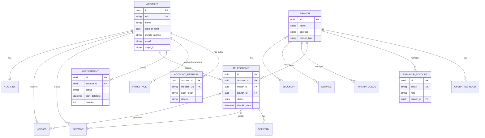

# Database Schema

This document describes the PostgreSQL database schema for the PinnacleSG medical application, including Mermaid Entity-Relationship diagrams derived from the SQLAlchemy models.

## Entity Relationship Overview



## Complete Model Inventory

The backend contains **35+ SQLAlchemy models** organized into domains:

| Domain | Models | Primary Tables |
|--------|--------|----------------|
| Patient | Account, AccountFirebase, FamilyNok, AccountYuuLink | `patient_accounts`, `patient_firebase_auths`, `patient_family` |
| Appointment | Appointment, ServiceGroup, Service, CorporateCode | `patient_appointments`, `appointment_service_groups`, `appointment_services` |
| Teleconsult | Teleconsult | `teleconsult_queues` |
| Walk-in | WalkInQueue | `walkin_queues` |
| Payment | Payment, Invoice, CorporateCode, PaymentToken | `payment_logs`, `payment_invoices`, `payment_corporate_codes` |
| Delivery | TeleconsultDelivery, PinnacleZone | `teleconsult_deliveries`, `teleconsult_delivery_zones` |
| Clinic | Branch, PinnacleAccount, OperatingHour, Blockoff | `pinnacle_branches`, `pinnacle_accounts`, `pinnacle_branches_operating_hours` |
| Document | Document, HealthReport | `patient_documents`, `patient_health_reports` |
| SGiMed | SGiMedAppointment, Inventory, HL7Log, Measurement | `sgimed_appointments`, `sgimed_inventory`, `sgimed_hl7_logs` |
| Corporate | CorporateAuth, CorporateUser | `corporate_authorisations`, `corporate_users` |
| Backend | CronLog, NotificationLog, SystemConfig | `backend_crons`, `backend_notifications`, `backend_configs` |

---

## Core Tables Details

### Patient Domain

#### `patient_accounts`
Primary patient/user table with SGiMed integration and Stripe support.

| Column | Type | Description |
|--------|------|-------------|
| `id` | UUID | Primary key |
| `sgimed_patient_id` | String | SGiMed healthcare system ID |
| `sgimed_patient_given_id` | String | Alternative SGiMed ID |
| `sgimed_auth_code` | String | SGiMed authorization code |
| `sgimed_synced` | Boolean | Sync status flag |
| `nric` | String | Singapore NRIC (unique, indexed) |
| `name` | String | Full name |
| `ic_type` | Enum | PINK_IC, BLUE_IC, FIN_NUMBER, PASSPORT |
| `gender` | Enum | Male, Female, Unknown |
| `date_of_birth` | Date | DOB |
| `nationality` | Enum | SGiMed nationality code |
| `language` | Enum | Preferred language |
| `mobile_code` | Enum | Phone country code (+65, etc.) |
| `mobile_number` | String | Phone number |
| `secondary_mobile_code` | Enum | Secondary phone country code |
| `secondary_mobile_number` | String | Secondary phone number |
| `email` | String | Email address |
| `postal` | String | Postal code |
| `address` | String | Street address |
| `unit` | String | Unit number |
| `building` | String | Building name |
| `residential_postal` | String | Residential postal code |
| `residential_address` | String | Residential address |
| `allergy` | String | Known allergies |
| `stripe_id` | String | Stripe customer ID |
| `default_payment_method` | Enum | Preferred payment method |
| `default_payment_id` | String | Default payment method ID |

**Relationships:**
- `firebase_auths` → AccountFirebase (one-to-many)
- `payments` → Payment (one-to-many)
- `teleconsults` → Teleconsult (one-to-many)
- `walkins` → WalkInQueue (one-to-many)
- `invoices` → Invoice (one-to-many)
- `family_members` → FamilyNok (one-to-many)
- `payment_tokens` → PaymentToken (one-to-many)
- `yuu_link` → AccountYuuLink (one-to-one)

**Methods:**
- `get_linked_account_ids()` - Get all linked family account IDs
- `get_linked_sgimed_patient_ids()` - Get linked SGiMed patient IDs
- `calculate_age()` - Calculate patient age
- `get_address()` - Get formatted full address

#### `patient_firebase_auths`
Firebase authentication records linking Firebase UIDs to patient accounts.

| Column | Type | Description |
|--------|------|-------------|
| `account_id` | UUID | FK to patient_accounts (composite PK) |
| `firebase_uid` | String | Firebase UID (composite PK) |
| `push_token` | String | Push notification token |
| `fcm_token` | String | Firebase Cloud Messaging token |
| `apn_token` | String | Apple Push Notification token |
| `device` | String | Device identifier |
| `login_type` | Enum | PHONE or EMAIL |

#### `patient_family`
Family member/dependant relationships (Next of Kin).

| Column | Type | Description |
|--------|------|-------------|
| `id` | Integer | Primary key (autoincrement) |
| `account_id` | UUID | Parent account FK |
| `nok_id` | UUID | Dependant account FK |
| `sgimed_nok_id` | String | SGiMed relationship ID |
| `relation` | Enum | Spouse, Children, Parent, Grandparent, In-Laws, Siblings, Guardian, Other |
| `deleted` | Boolean | Soft delete flag |

#### `patient_account_yuu_links`
Yuu healthcare platform linking.

| Column | Type | Description |
|--------|------|-------------|
| `id` | UUID | Primary key |
| `account_id` | UUID | FK to patient_accounts |
| `tomo_id` | String | Yuu member ID |
| `user_identifier` | String | User identifier |
| `linked_at` | DateTime | Link timestamp |
| `deleted` | Boolean | Soft delete flag |
| `deleted_at` | DateTime | Deletion timestamp |

---

### Visit Domain

#### `teleconsult_queues`
Video consultation sessions with full lifecycle tracking.

| Column | Type | Description |
|--------|------|-------------|
| `id` | UUID | Primary key |
| `account_id` | UUID | Patient account FK |
| `patient_type` | Enum | PRIVATE_PATIENT, MIGRANT_WORKER |
| `allergy` | String | Patient allergies |
| `sgimed_visit_id` | String | SGiMed visit reference |
| `queue_number` | String | Queue display number |
| `queue_status` | String | Queue status message |
| `address` | String | Patient address |
| `status` | Enum | Teleconsult status |
| `corporate_code` | String | Discount code |
| `payment_breakdown` | JSON | Payment details |
| `total` | Float | Total amount |
| `balance` | Float | Outstanding balance |
| `collection_method` | Enum | DELIVERY, PICKUP, WALKIN |
| `additional_status` | Enum | Secondary status (e.g., Missed) |
| `notifications_sent` | Array | Sent notification types |
| `teleconsult_start_time` | DateTime | Video call start |
| `teleconsult_join_time` | DateTime | Patient join time |
| `teleconsult_end_time` | DateTime | Video call end |
| `checkin_time` | DateTime | Check-in timestamp |
| `checkout_time` | DateTime | Check-out timestamp |
| `doctor_id` | UUID | Assigned doctor FK |
| `branch_id` | UUID | Clinic branch FK |
| `created_by` | UUID | Creator account FK |
| `group_id` | UUID | Family booking group |
| `index` | Integer | Position in group |

**Status Flow:**
```
PREPAYMENT → CHECKED_IN → CONSULT_START → CONSULT_END → OUTSTANDING → CHECKED_OUT
                                                      ↓
                                                 DISPENSE_MEDICATION
Also: CANCELLED, MISSED
```

**Relationships:**
- `account` → Account
- `branch` → Branch
- `doctor` → PinnacleAccount
- `payments` → Payment (many-to-many)
- `invoices` → Invoice (many-to-many)
- `documents` → Document (many-to-many)
- `teleconsult_delivery` → TeleconsultDelivery

#### `walkin_queues`
Walk-in queue management.

| Column | Type | Description |
|--------|------|-------------|
| `id` | UUID | Primary key |
| `branch_id` | UUID | Branch FK |
| `account_id` | UUID | Patient FK |
| `queue_number` | String | Display number |
| `sgimed_pending_queue_id` | String | SGiMed queue ID |
| `sgimed_visit_id` | String | SGiMed visit ID |
| `service` | String | Service type |
| `queue_status` | String | Status message |
| `checkin_time` | DateTime | Check-in time |
| `checkout_time` | DateTime | Check-out time |
| `status` | Enum | PENDING, CHECKED_IN, CONSULT_START, CHECKED_OUT, REJECTED, CANCELLED, MISSED |
| `notifications_sent` | Array | Sent notifications |
| `remarks` | String | Additional notes |
| `created_by` | UUID | Creator FK |
| `group_id` | UUID | Family group |

#### `patient_appointments`
Health screening appointments.

| Column | Type | Description |
|--------|------|-------------|
| `id` | UUID | Primary key |
| `account_id` | UUID | Patient account FK (nullable for guests) |
| `created_by` | UUID | Creator account FK |
| `sgimed_appointment_id` | String | SGiMed appointment ID |
| `corporate_code` | String | Corporate discount code |
| `affiliate_code` | String | Affiliate code |
| `services` | JSON | Selected services array |
| `guests` | JSON | Guest patient details |
| `branch` | JSON | Branch information |
| `start_datetime` | DateTime | Appointment time |
| `duration` | Integer | Duration in minutes |
| `patient_survey` | JSON | Pre-appointment survey |
| `corporate_survey` | JSON | Company survey |
| `status` | Enum | Appointment status |
| `payment_breakdown` | JSON | Payment details |
| `payment_ids` | Array | Payment record references |
| `invoice_ids` | Array | Invoice references |
| `notifications_sent` | Array | Sent notifications |
| `group_id` | UUID | Family booking group |
| `index` | Integer | Position in group |

**Status Flow:**
```
PREPAYMENT → PAYMENT_STARTED → CONFIRMED → COMPLETED
Also: CANCELLED, MISSED
```

---

### Appointment Configuration

#### `appointment_service_groups`
Service categories for health screenings.

| Column | Type | Description |
|--------|------|-------------|
| `id` | UUID | Primary key |
| `name` | String | Group name |
| `title` | String | Display title |
| `description` | String | Description |
| `index` | Integer | Sort order |
| `icon` | String | Icon URL |
| `duration` | Integer | Duration in minutes |
| `type` | Enum | NO_DETAIL, SINGLE, MULTIPLE |
| `restricted_branches` | Array | Branch restrictions |
| `unsupported_branches` | Array | Excluded branches |
| `restricted_memberships` | Array | Membership restrictions |
| `start_date` | DateTime | Availability start |
| `end_date` | DateTime | Availability end |
| `category` | Enum | GENERAL, SPECIALIST |
| `corporate_code_id` | UUID | Linked corporate code FK |

#### `appointment_services`
Individual services within groups.

| Column | Type | Description |
|--------|------|-------------|
| `id` | UUID | Primary key |
| `group_id` | UUID | Parent service group FK |
| `sgimed_inventory_id` | String | SGiMed inventory FK |
| `name` | String | Service name |
| `prepayment_price` | Float | Required prepayment |
| `display_price` | Float | Display price |
| `index` | Integer | Sort order |
| `min_booking_ahead_days` | Integer | Minimum advance booking days (default: 2) |
| `restricted_branches` | Array | Branch restrictions |
| `unsupported_branches` | Array | Excluded branches |
| `tests` | JSON | Associated tests |

#### `appointment_corporate_codes`
Corporate codes for health screening packages.

| Column | Type | Description |
|--------|------|-------------|
| `id` | UUID | Primary key |
| `code` | String | Unique code (e.g., "COMPANY2024") |
| `organization` | String | Organization name |
| `patient_survey` | JSON | Pre-appointment survey |
| `corporate_survey` | JSON | Company-specific survey |
| `only_primary_user` | Boolean | Prevent dependant booking |
| `valid_from` | DateTime | Code validity start |
| `valid_to` | DateTime | Code validity end |
| `is_active` | Boolean | Active flag |
| `category` | Enum | GENERAL, SPECIALIST |

#### `appointment_onsite_branches`
Onsite branch configurations for corporate codes.

| Column | Type | Description |
|--------|------|-------------|
| `id` | Integer | Primary key |
| `branch_id` | UUID | Branch FK |
| `corporate_code_id` | UUID | Corporate code FK |
| `header` | String | Display header |
| `start_date` | DateTime | Start date |
| `end_date` | DateTime | End date |
| `category` | Enum | Category |

#### `appointment_counts`
Appointment slot availability tracking.

| Column | Type | Description |
|--------|------|-------------|
| `id` | Integer | Primary key |
| `sgimed_branch_id` | String | SGiMed branch (indexed) |
| `sgimed_calendar_id` | String | Calendar ID (indexed) |
| `time` | DateTime | Time slot (indexed) |
| `count` | Integer | Booked count |

---

### Payment Domain

#### `payment_logs`
All payment transactions.

| Column | Type | Description |
|--------|------|-------------|
| `id` | UUID | Primary key |
| `payment_id` | String | Provider transaction ID |
| `account_id` | UUID | Patient account FK |
| `payment_breakdown` | JSON | Line items |
| `payment_type` | Enum | PREPAYMENT, POSTPAYMENT, APPOINTMENT, TOKENIZATION |
| `payment_method` | Enum | NETS_CLICK, CARD_STRIPE, PAYNOW_*, etc. |
| `payment_provider` | Enum | APP_STRIPE, APP_NETS_CLICK, APP_2C2P |
| `payment_amount` | Float | Amount paid |
| `status` | Enum | CREATED, SUCCESS, FAILED, EXPIRED, CANCELED |
| `remarks` | JSON | Additional notes |

#### `payment_invoices`
SGiMed invoice records.

| Column | Type | Description |
|--------|------|-------------|
| `id` | String | SGiMed invoice ID (PK) |
| `visit_type` | Enum | TELECONSULT, WALKIN, APPOINTMENT |
| `account_id` | UUID | Patient account FK |
| `amount` | Float | Total amount |
| `invoice_html` | String | Rendered invoice HTML |
| `mc_html` | String | Medical certificate HTML |
| `items` | JSON | Invoice line items |
| `prescriptions` | JSON | Prescribed medications |
| `hide_invoice` | Boolean | Hide from patient |
| `show_details` | Boolean | Show detailed view |
| `sgimed_last_edited` | String | SGiMed edit timestamp |

#### `payment_corporate_codes`
Teleconsult discount codes.

| Column | Type | Description |
|--------|------|-------------|
| `id` | Integer | Primary key |
| `code` | String | Unique code (indexed) |
| `deleted` | Boolean | Soft delete flag |
| `allow_user_input` | Boolean | User can enter code |
| `remarks` | String | Notes |
| `skip_prepayment` | Boolean | Skip prepayment |
| `hide_invoice` | Boolean | Hide invoice |
| `sgimed_consultation_inventory_ids` | Array | SGiMed inventory IDs |
| `priority_index` | Integer | Priority (lower = higher) |

#### `payment_tokens`
Saved payment methods.

| Column | Type | Description |
|--------|------|-------------|
| `id` | UUID | Primary key |
| `account_id` | UUID | Patient account FK |
| `provider` | Enum | Payment provider |
| `method` | Enum | Payment method |
| `token` | String | Token value |
| `details` | JSON | Card/method details |
| `deleted` | Boolean | Soft delete flag |

#### `payment_reconciliations`
Payment reconciliation records.

| Column | Type | Description |
|--------|------|-------------|
| `id` | Integer | Primary key |
| `payment_id` | String | Payment ID (unique) |
| `completed_at` | DateTime | Completion time (indexed) |
| `branch` | String | Branch name |
| `patients` | Array | Patient identifiers |
| `sgimed_visit_id` | Array | Visit IDs |
| `payment_type` | String | Type |
| `payment_provider` | String | Provider |
| `payment_method` | String | Method |
| `payment_amount` | Float | Total amount |
| `payment_amount_nett` | Float | Net amount |
| `payment_platform_fees` | Float | Platform fees |

---

### Delivery Domain

#### `teleconsult_deliveries`
Medication delivery tracking.

| Column | Type | Description |
|--------|------|-------------|
| `id` | UUID | Primary key |
| `teleconsult_id` | UUID | Teleconsult FK |
| `dispatch_id` | UUID | Dispatcher FK |
| `patient_id` | UUID | Patient FK |
| `zone` | Enum | Delivery zone |
| `address` | String | Delivery address |
| `postal` | String | Postal code |
| `status` | Enum | PENDING, DISPATCHED, DELIVERED, etc. |
| `dispatch_history` | JSON | Dispatch history |
| `is_migrant` | Boolean | Migrant worker flag |
| `number_of_packages` | Integer | Package count |
| `delivery_date` | Date | Scheduled delivery |
| `delivery_attempt` | Integer | Attempt count |
| `recipient_name` | String | Recipient name |
| `receipt_date` | DateTime | Receipt timestamp |
| `is_delivery_note_exists` | Boolean | Has delivery note |
| `delivery_note_file_path` | String | Note file path |
| `group_id` | UUID | Family group |

#### `teleconsult_delivery_zones`
Postal code to zone mapping.

| Column | Type | Description |
|--------|------|-------------|
| `id` | Integer | Primary key |
| `sector_code` | String | Postal sector (unique, indexed) |
| `zone` | Enum | Delivery zone |
| `has_service` | Boolean | Service available |
| `is_migrant_area` | Boolean | Migrant worker area |

---

### Clinic Operations

#### `pinnacle_branches`
Clinic branch locations.

| Column | Type | Description |
|--------|------|-------------|
| `id` | UUID | Primary key |
| `sgimed_branch_id` | String | SGiMed branch ID (indexed) |
| `name` | String | Branch name |
| `address` | String | Physical address |
| `phone` | String | Contact phone |
| `whatsapp` | String | WhatsApp number |
| `email` | String | Email address |
| `url` | String | Website URL |
| `image_url` | String | Branch image |
| `category` | String | North, Central, East, West |
| `walk_in_curr_queue_number` | String | Current queue number |
| `sgimed_calendar_id` | String | Appointment calendar ID |
| `sgimed_appointment_type_id` | String | Default appointment type |
| `branch_type` | Enum | MAIN, ONSITE |
| `has_delivery_operating_hours` | Boolean | Has delivery hours |
| `hidden` | Boolean | Hidden from listing |
| `deleted` | Boolean | Soft delete flag |

**Relationships:**
- `walkin_queues` → WalkInQueue (one-to-many)
- `operating_hours` → OperatingHour (one-to-many)
- `accounts` → PinnacleAccount (one-to-many)
- `teleconsults` → Teleconsult (one-to-many)
- `services` → Service (many-to-many)
- `blockoffs` → Blockoff (many-to-many)

#### `pinnacle_accounts`
Admin/doctor accounts.

| Column | Type | Description |
|--------|------|-------------|
| `id` | UUID | Primary key |
| `supabase_uid` | String | Supabase auth UID |
| `sgimed_id` | String | SGiMed doctor ID |
| `branch_id` | UUID | Assigned branch FK |
| `name` | String | Full name |
| `email` | String | Login email |
| `role` | Enum | SUPERADMIN, ADMIN, DOCTOR, LOGISTIC, DISPATCH |
| `push_token` | Array | Push notification tokens |
| `enable_notifications` | Boolean | Notifications enabled |
| `deleted` | Boolean | Soft delete flag |

#### `pinnacle_branches_operating_hours`
Branch operating hours.

| Column | Type | Description |
|--------|------|-------------|
| `id` | Integer | Primary key |
| `branch_id` | UUID | Branch FK |
| `day` | Enum | MONDAY-SUNDAY, PUBLIC_HOLIDAY |
| `start_time` | Time | Opening time |
| `end_time` | Time | Closing time |
| `cutoff_time` | Integer | Cutoff minutes before close |

#### `pinnacle_blockoffs`
Scheduling block-off periods.

| Column | Type | Description |
|--------|------|-------------|
| `id` | Integer | Primary key |
| `date` | Date | Block date |
| `start_time` | Time | Start time |
| `end_time` | Time | End time |
| `enabled` | Boolean | Is enabled |
| `deleted` | Boolean | Soft delete |
| `allow_toggle` | Boolean | Can toggle |
| `created_by` | String | Creator |
| `remarks` | String | Notes |

#### `pinnacle_public_holidays`
Public holiday calendar.

| Column | Type | Description |
|--------|------|-------------|
| `id` | Integer | Primary key |
| `date` | Date | Holiday date |
| `remarks` | String | Holiday name |

---

### Document Domain

#### `patient_documents`
Medical documents from SGiMed.

| Column | Type | Description |
|--------|------|-------------|
| `id` | UUID | Primary key |
| `sgimed_patient_id` | String | SGiMed patient ID |
| `sgimed_document_id` | String | SGiMed document ID (unique) |
| `sgimed_branch_id` | String | SGiMed branch ID |
| `sgimed_visit_id` | String | SGiMed visit ID |
| `status` | Enum | Document status |
| `name` | String | Document name |
| `document_date` | DateTime | Document date |
| `remarks` | String | Notes |
| `document_type` | Enum | MC, REFERRAL, LAB_REPORT, etc. |
| `hidden` | Boolean | Hidden flag |
| `notification_sent` | Boolean | Notification sent flag |

#### `patient_health_reports`
Health report summaries.

| Column | Type | Description |
|--------|------|-------------|
| `sgimed_hl7_id` | String | HL7 ID (PK) |
| `sgimed_hl7_content` | String | HL7 content |
| `sgimed_patient_id` | String | Patient ID |
| `sgimed_report_id` | String | Report ID (unique) |
| `sgimed_report_file_date` | DateTime | Report date |
| `patient_test_results` | String | Test results |
| `report_summary` | String | Summary |
| `disclaimer_accepted_at` | DateTime | Disclaimer acceptance |

---

### SGiMed Integration

#### `sgimed_appointments`
Synced appointments from SGiMed (read-only mirror).

| Column | Type | Description |
|--------|------|-------------|
| `id` | String | SGiMed appointment ID (PK) |
| `subject` | String | Appointment subject |
| `patient_id` | String | SGiMed patient ID |
| `calendar_id` | String | Calendar reference |
| `branch_id` | String | Branch reference |
| `appointment_type_id` | String | Appointment type |
| `is_all_day` | Boolean | All-day flag |
| `is_informed` | Boolean | Patient informed |
| `is_queued` | Boolean | In queue |
| `is_cancelled` | Boolean | Cancellation status |
| `is_confirmed` | Boolean | Confirmation status |
| `start_datetime` | DateTime | Appointment start |
| `end_datetime` | DateTime | Appointment end |
| `confirm_time` | DateTime | Confirmation time |
| `confirm_user` | String | Confirming user |
| `last_edited` | DateTime | Last edit time |
| `created_at` | DateTime | Creation time |

#### `sgimed_inventory`
SGiMed service/drug/lab item catalog.

| Column | Type | Description |
|--------|------|-------------|
| `id` | String | Item ID (PK, indexed) |
| `code` | String | Item code (indexed) |
| `name` | String | Item name |
| `type` | String | Service, Drugs, Lab |
| `remark` | String | Notes |
| `is_stock_tracked` | Boolean | Stock tracking |
| `price` | Float | Price |
| `inventory_json` | JSON | Full inventory data |
| `category_id` | String | Category ID |
| `last_edited` | DateTime | Last edit |
| `created_at` | DateTime | Creation time |

#### `sgimed_measurements`
Patient measurements from SGiMed.

| Column | Type | Description |
|--------|------|-------------|
| `id` | String | Measurement ID (PK) |
| `branch_id` | String | Branch ID |
| `patient_id` | String | Patient ID (indexed) |
| `type_name` | String | Measurement type |
| `type_unit` | String | Unit of measurement |
| `value` | String | Measurement value |
| `measurement_date` | DateTime | Date (indexed) |
| `last_edited` | DateTime | Last edit |
| `created_at` | DateTime | Creation time |

#### `sgimed_hl7_logs`
HL7 health record imports.

| Column | Type | Description |
|--------|------|-------------|
| `id` | String | Log ID (PK) |
| `vendor` | String | Data vendor |
| `nric` | String | Patient NRIC |
| `branch_id` | String | Branch ID |
| `patient_id` | String | Patient ID (indexed) |
| `report_file_id` | String | Report file ID (indexed) |
| `hl7_content` | String | HL7 content |
| `last_edited` | DateTime | Last edit |
| `created_at` | DateTime | Creation time |

#### `sgimed_incoming_reports`
Incoming report tracking.

| Column | Type | Description |
|--------|------|-------------|
| `id` | String | Report ID (PK) |
| `patient_id` | String | Patient ID (indexed) |
| `nric` | String | Patient NRIC |
| `vendor` | String | Data vendor |
| `status` | String | Processing status |
| `branch_id` | String | Branch ID |
| `visit_id` | String | Visit ID |
| `file_name` | String | File name |
| `report_file_id` | String | Report file ID (indexed) |
| `file_date` | DateTime | File date |
| `info_json` | String | Additional info |
| `last_edited` | DateTime | Last edit |
| `health_report_generated` | Boolean | Report generated flag |

---

### Backend Utility Tables

#### `backend_crons`
Cron job progress tracking.

| Column | Type | Description |
|--------|------|-------------|
| `id` | String | Job ID (PK) |
| `last_modified` | DateTime | Last run time |
| `last_page` | Integer | Last processed page |

#### `backend_configs`
Application configuration storage.

| Column | Type | Description |
|--------|------|-------------|
| `key` | String | Config key (PK) |
| `value` | String | Config value |
| `value_type` | String | Type: string, boolean, integer, float, json |
| `description` | String | Description |
| `category` | String | Config category |

---

## Enums Reference

### Visit Status Enums

```python
# Teleconsult Status
PREPAYMENT → CHECKED_IN → CONSULT_START → CONSULT_END → OUTSTANDING → CHECKED_OUT
                                                      ↓
                                                 DISPENSE_MEDICATION
Also: CANCELLED, MISSED

# Appointment Status
PREPAYMENT → PAYMENT_STARTED → CONFIRMED → COMPLETED
Also: CANCELLED, MISSED

# Walk-in Status
PENDING → CHECKED_IN → CONSULT_START → CHECKED_OUT
Also: REJECTED, CANCELLED, MISSED

# Delivery Status
PENDING → DISPATCHED → OUT_FOR_DELIVERY → DELIVERED
Also: FAILED, RETURNED
```

### Payment Enums

```python
# Payment Method
NETS_CLICK, CARD_STRIPE, CARD_SGIMED, CARD_2C2P
PAYNOW_NETS, PAYNOW_STRIPE, PAYNOW_2C2P
DEFERRED_PAYMENT

# Payment Status
PAYMENT_CREATED → PAYMENT_SUCCESS
              ↓
         PAYMENT_FAILED / PAYMENT_EXPIRED / PAYMENT_CANCELED

# Payment Provider
APP_STRIPE, APP_NETS_CLICK, APP_2C2P
```

### Patient Enums

```python
# IC Type (SGiMedICType)
PINK_IC, BLUE_IC/ENTRY_PERMIT, FIN_NUMBER, PASSPORT

# Gender
Male, Female, Unknown

# Family Relation (SGiMedNokRelation)
Spouse, Children, Parent, Grandparent, In-Laws, Siblings, Guardian, Other

# Patient Type
PRIVATE_PATIENT, MIGRANT_WORKER
```

### Clinic Enums

```python
# Role
SUPERADMIN, ADMIN, DOCTOR, LOGISTIC, DISPATCH

# Branch Type
MAIN, ONSITE

# Day of Week
MONDAY, TUESDAY, WEDNESDAY, THURSDAY, FRIDAY, SATURDAY, SUNDAY, PUBLIC_HOLIDAY

# Delivery Zone
ZONE_1, ZONE_2, ZONE_3, UNKNOWN
```

---

## Association Tables

Many-to-many relationships use association tables:

| Table | Links | Purpose |
|-------|-------|---------|
| `teleconsult_invoices` | Teleconsult ↔ Invoice | Invoice association |
| `teleconsult_documents` | Teleconsult ↔ Document | Document association |
| `teleconsult_payments` | Teleconsult ↔ Payment | Payment association |
| `walkin_invoices` | WalkInQueue ↔ Invoice | Invoice association |
| `walkin_documents` | WalkInQueue ↔ Document | Document association |
| `pinnacle_branch_services` | Branch ↔ Service | Service availability |
| `pinnacle_branch_blockoffs` | Branch ↔ Blockoff | Scheduling blocks |

---

## Indexes

Key indexed columns for query performance:

### Patient Domain
- `patient_accounts.nric` (unique)
- `patient_accounts.sgimed_patient_id` (unique)
- `patient_firebase_auths.firebase_uid` (unique)

### Visit Domain
- `teleconsult_queues.account_id`
- `teleconsult_queues.branch_id`
- `walkin_queues.branch_id`
- `walkin_queues.account_id`
- `patient_appointments.account_id`
- `patient_appointments.group_id`

### Payment Domain
- `payment_corporate_codes.code` (unique)
- `payment_reconciliations.payment_id` (unique)
- `payment_reconciliations.completed_at`

### SGiMed Domain
- `sgimed_appointments.id`
- `sgimed_inventory.id`
- `sgimed_inventory.code`
- `sgimed_measurements.patient_id`
- `sgimed_measurements.measurement_date`
- `sgimed_hl7_logs.patient_id`
- `sgimed_hl7_logs.report_file_id`
- `sgimed_incoming_reports.patient_id`
- `sgimed_incoming_reports.report_file_id`

### Clinic Domain
- `pinnacle_branches.sgimed_branch_id`
- `teleconsult_delivery_zones.sector_code` (unique)
- `appointment_counts.sgimed_branch_id`
- `appointment_counts.sgimed_calendar_id`
- `appointment_counts.time`

---

**Last Updated**: 2026-01-16
