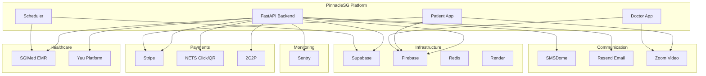
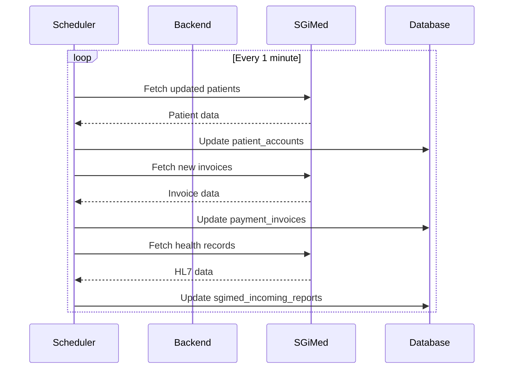
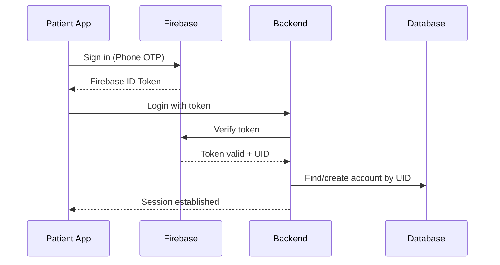
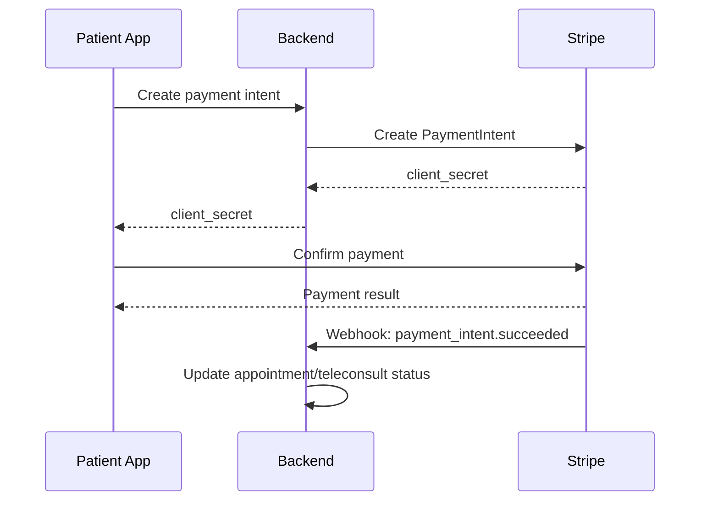
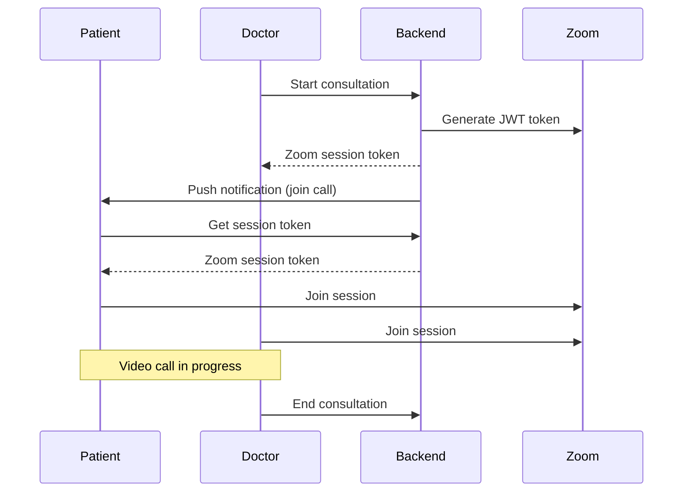

# External Integrations

This document details the external systems integrated with the PinnacleSG platform.

## Integration Architecture



## SGiMed (Electronic Medical Records)

### Overview
SGiMed is the master healthcare system for clinic operations, serving as the source of truth for patient records, appointments, and medical data.

### Integration Points

| Feature | Direction | Frequency | Description |
|---------|-----------|-----------|-------------|
| Patient Profiles | Bidirectional | Real-time | Create/update patient records |
| Appointments | Bidirectional | Real-time + Sync | Book, reschedule, cancel appointments |
| Health Records | SGiMed → App | Every 1 min | HL7 health data, lab results |
| Invoices | SGiMed → App | Every 1 min | Billing and payment records |
| Inventory | SGiMed → App | Every 5 min | Services, appointment types |
| Documents | SGiMed → App | On demand | MCs, prescriptions, referrals |

### Data Synchronization



### Configuration

```python
# Environment variables
SGIMED_API_URL=https://api.sgimed.com
SGIMED_API_KEY=<api_key>
SGIMED_DEFAULT_BRANCH_ID=<branch_id>
SGIMED_TELEMED_APPT_TYPE_ID=<appointment_type>
SGIMED_GST_RATE=0.09
SGIMED_WEBHOOK_PUBLIC_KEY=<public_key>
```

### Key Endpoints Used

| Endpoint | Purpose |
|----------|---------|
| `GET /patients/{id}` | Fetch patient profile |
| `POST /patients` | Create new patient |
| `PUT /patients/{id}` | Update patient |
| `GET /appointments` | List appointments |
| `POST /appointments` | Create appointment |
| `GET /invoices` | Fetch invoices |
| `GET /health-records` | Fetch HL7 data |

---

## Supabase (Data Layer)

### Overview
Supabase provides the PostgreSQL database, authentication for admin users, and real-time subscriptions.

### Components Used

| Component | Purpose |
|-----------|---------|
| PostgreSQL | Primary data storage |
| Auth | Admin web portal authentication |
| Realtime | Queue status updates, notifications |
| Storage | File uploads (S3-compatible) |

### Database Connection

```python
# SQLAlchemy connection
from sqlalchemy import create_engine
engine = create_engine(
    POSTGRES_URL,
    pool_size=40,
    pool_recycle=300
)
```

### Realtime Subscriptions

```typescript
// Frontend subscription example
const channel = supabase
  .channel('teleconsult-queue')
  .on(
    'postgres_changes',
    { event: '*', schema: 'public', table: 'teleconsult_queues' },
    (payload) => {
      // Handle queue update
    }
  )
  .subscribe();
```

### Storage Buckets

| Bucket | Purpose | Access |
|--------|---------|--------|
| `uploads` | Patient documents, photos | Public |
| `private` | Medical records, invoices | Authenticated |

---

## Firebase (Authentication & Notifications)

### Overview
Firebase handles patient authentication and push notifications for both mobile apps.

### Services Used

| Service | Purpose |
|---------|---------|
| Authentication | Phone OTP, email login for patients |
| Cloud Messaging (FCM) | Push notifications |
| Crashlytics | Mobile app crash reporting |

### Authentication Flow



### Push Notification Types

| Notification | Trigger | Payload |
|--------------|---------|---------|
| Queue Update | Teleconsult status change | queue_id, status |
| Appointment Reminder | 24h before appointment | appointment_id |
| Document Ready | New document available | document_type |
| Payment Confirmation | Payment success | payment_id |

### Configuration

```python
# Firebase Admin SDK initialization
firebase_admin.initialize_app(credential=credentials.Certificate({
    "type": "service_account",
    "project_id": FIREBASE_PROJECT_ID,
    "private_key": FIREBASE_PRIVATE_KEY,
    "client_email": FIREBASE_CLIENT_EMAIL,
    # ... other credentials
}))
```

---

## Payment Gateways

### Stripe (Primary)

| Feature | Implementation |
|---------|----------------|
| Card Payments | Stripe Elements (web), Mobile SDK |
| PayNow | Stripe PayNow integration |
| Webhooks | Payment confirmation callbacks |
| Customers | Stripe Customer objects for saved cards |

**Payment Flow:**


**Configuration:**
```python
STRIPE_SECRET_KEY=sk_live_...
STRIPE_PUBLISHABLE_KEY=pk_live_...
STRIPE_WEBHOOK_SECRET=whsec_...
```

### NETS Click/QR

| Feature | Purpose |
|---------|---------|
| NETS Click | eWallet payments |
| NETS QR | QR code payments |

**Implementation:** Located in `routers/payments/nets_click/` and `routers/payments/nets_qr/`

### 2C2P

| Feature | Purpose |
|---------|---------|
| Regional Payments | Alternative payment methods |
| Card Processing | Secondary card processor |

**Configuration:**
```python
PAYMENT_2C2P_ENDPOINT=https://pgw.2c2p.com
PAYMENT_2C2P_MERCHANT_ID=<merchant_id>
PAYMENT_2C2P_MERCHANT_SHA_KEY=<sha_key>
PAYMENT_2C2P_CURRENCY_CODE=SGD
```

---

## Zoom Video SDK

### Overview
Zoom Video SDK powers teleconsultation video calls between patients and doctors.

### Integration

| App | SDK Version |
|-----|-------------|
| Patient App | @zoom/react-native-videosdk 2.4.5 |
| Doctor App | @zoom/react-native-videosdk 1.13.12 |

### Session Flow



**Configuration:**
```python
ZOOM_APP_KEY=<app_key>
ZOOM_APP_SECRET=<app_secret>
```

---

## Yuu Healthcare Platform

### Overview
Yuu is a healthcare data sharing platform for patient consent management.

### Integration

| Feature | Purpose |
|---------|---------|
| Patient Consent | Manage data sharing preferences |
| Health Data Export | Share records with Yuu network |
| Transaction Refunds | Monthly refund processing |

**Configuration:**
```python
YUU_CLIENT_ID=<client_id>
YUU_CLIENT_SECRET=<client_secret>
YUU_API_URL=https://api.yuu.sg
YUU_PINNACLE_PRIVATE_KEY=<private_key>
YUU_PINNACLE_PRIVATE_KEYPHRASE=<keyphrase>
```

---

## Communication Services

### SMSDome (SMS/OTP)

| Feature | Purpose |
|---------|---------|
| OTP Delivery | Phone verification during registration |
| Appointment Reminders | SMS notifications |

**Configuration:**
```python
SMSDOME_URL=https://api.smsdome.com
SMSDOME_APPID=<app_id>
SMSDOME_APPSECRET=<app_secret>
```

### Resend (Email)

| Feature | Purpose |
|---------|---------|
| Transactional Emails | Appointment confirmations, invoices |
| Admin Notifications | System alerts |

**Configuration:**
```python
RESEND_API_KEY=<api_key>
```

---

## Monitoring & Analytics

### Sentry

| Platform | SDK |
|----------|-----|
| Backend | sentry-sdk (Python) |
| Patient App | @sentry/react-native |
| Doctor App | @sentry/react-native |
| Admin Web | @sentry/react |

**Configuration:**
```python
SENTRY_DSN=https://<key>@sentry.io/<project>
```

**Features:**
- Error tracking with stack traces
- Performance monitoring
- Release tracking
- User context for debugging

---

## Infrastructure

### Render (Hosting)

| Service | Deployment |
|---------|------------|
| Backend API | Auto-deploy from GitHub |
| Scheduler | Separate worker process |

**Deployment Flow:**
1. Push to main branch in monorepo
2. GitHub Actions syncs to individual repos
3. Render detects changes
4. Auto-deploy triggered

### Redis (Caching)

| Use Case | Purpose |
|----------|---------|
| Session Cache | Temporary session data |
| Rate Limiting | API rate limit tracking |
| WebSocket Broadcast | Pub/sub for real-time updates |

**Configuration:**
```python
REDIS_HOST=<host>
REDIS_PORT=6379
REDIS_DB=0
```

### BunJS PDF Server

| Feature | Purpose |
|---------|---------|
| PDF Generation | Invoices, reports, documents |
| Template Rendering | HTML to PDF conversion |

**Configuration:**
```python
BUNJS_SERVER_URL=https://pdf.pinnacle.com
```

---

## Webhook Security

### Verification Methods

| Integration | Method |
|-------------|--------|
| Stripe | Signature verification (HMAC-SHA256) |
| SGiMed | Public key signature |
| Supabase | API key header |

**Example (Stripe):**
```python
@router.post("/webhook")
async def stripe_webhook(request: Request):
    payload = await request.body()
    sig_header = request.headers.get("stripe-signature")

    event = stripe.Webhook.construct_event(
        payload, sig_header, STRIPE_WEBHOOK_SECRET
    )

    # Handle event...
```

---

**Last Updated**: 2026-01-16
