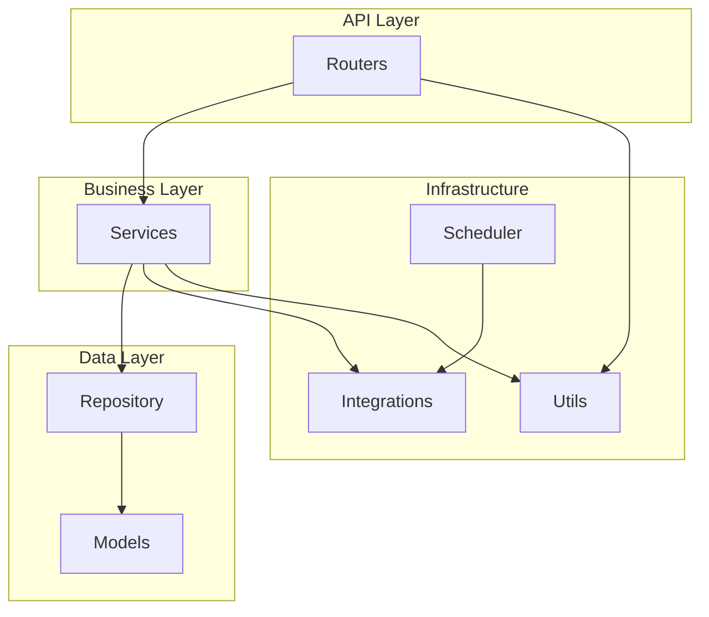
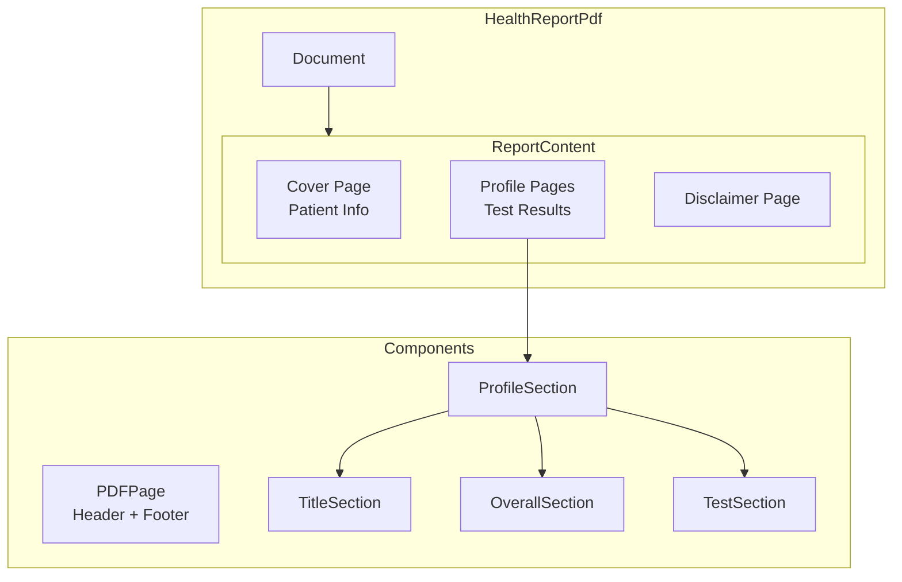
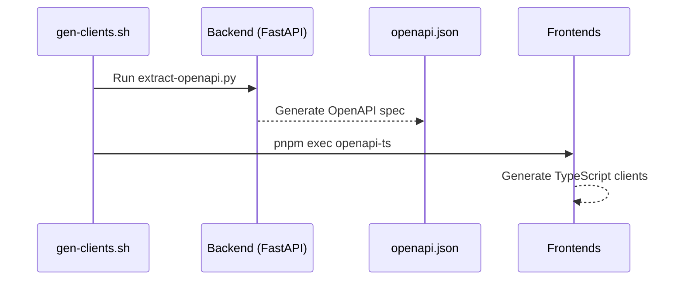

# Backend Architecture

This document provides detailed documentation of the FastAPI backend architecture in `backend-patient-app/`.

## Directory Structure

```
backend-patient-app/
├── main.py                    # Application entry point
├── config.py                  # Environment configuration
├── scheduler.py               # APScheduler background jobs
├── routers/                   # API endpoint handlers
│   ├── patient/               # Patient mobile app APIs
│   ├── doctor/                # Doctor app APIs
│   ├── admin/                 # Admin web portal APIs
│   ├── payments/              # Payment gateway integrations
│   └── delivery/              # Delivery/dispatch module
├── services/                  # Business logic layer
├── repository/                # Data access layer
├── models/                    # SQLAlchemy ORM + Pydantic schemas
├── utils/                     # Utility modules
│   └── integrations/          # External API clients
├── scheduler_actions/         # Background job implementations
├── alembic/                   # Database migrations
├── cli/                       # CLI testing tools
└── tests/                     # Unit tests
```

## Architectural Layers



## Router Organization

### Patient Mobile App (`/routers/patient/`)

| Router | Prefix | Purpose |
|--------|--------|---------|
| `auth.py` | `/api/auth` | Login, OTP verification, Firebase auth |
| `user.py` | `/api/user` | Profile management, settings |
| `appointment.py` | `/api/appointment/v1` | Booking, search, confirmation |
| `teleconsult.py` | `/api/teleconsult` | Video consultation queue |
| `teleconsult_family.py` | `/api/teleconsult/v2` | Family member teleconsults |
| `health_report.py` | `/api/health_report` | Health records, HL7 data |
| `family.py` | `/api/family` | Family member management |
| `document.py` | `/api/document` | Medical documents, prescriptions |
| `visits.py` | `/api/visits` | Visit history |
| `walkin.py` | `/api/walkin` | Walk-in queue management |
| `activity.py` | `/api/activity` | Activity feed, notifications |
| `support.py` | `/api/support` | Customer support tickets |
| `yuu.py` | `/api/v1/patient` | Yuu healthcare integration |
| `mobile_app.py` | `/api/mobile_app` | App version, metadata |

### Doctor App (`/routers/doctor/`)

| Router | Prefix | Purpose |
|--------|--------|---------|
| `doctor.py` | `/api/doctor` | Profile, schedule, patient list |
| `teleconsult.py` | `/api/doctor/teleconsult` | Consultation management |
| `realtime.py` | `/api/doctor/realtime` | Real-time notifications |

### Admin Web Portal (`/routers/admin/`)

| Router | Prefix | Purpose |
|--------|--------|---------|
| `admin.py` | `/api/admin` | Dashboard, configuration |
| `appointment.py` | `/api/admin/appointment` | Appointment CRUD, service groups |
| `patients.py` | `/api/admin/patients` | Patient management |
| `doctors.py` | `/api/admin/doctors` | Doctor management |
| `branch.py` | `/api/admin/branch` | Branch configuration |
| `blockoff.py` | `/api/admin/blockoff` | Doctor availability |
| `teleconsult.py` | `/api/admin/teleconsult` | Teleconsult monitoring |
| `walkin.py` | `/api/admin/walkin` | Walk-in queue interface |
| `health_reports.py` | `/api/admin/health_reports` | Health report generation |
| `rates.py` | `/api/admin/rates` | Pricing configuration |
| `corporate_codes.py` | `/api/admin/corporate_codes` | Corporate accounts |
| `documents.py` | `/api/admin/documents` | Document management |
| `specialists.py` | `/api/admin/specialists` | Specialist doctors |
| `notifications.py` | `/api/admin/notifications` | Notification management |
| `reports.py` | `/api/admin/reports` | Analytics, reporting |

### Payment Gateways (`/routers/payments/`)

| Router | Prefix | Purpose |
|--------|--------|---------|
| `stripe.py` | `/api/stripe/v1` | Stripe webhooks, payment intents |
| `payment_methods.py` | `/api/payment_methods` | Saved payment methods |
| `nets_click/` | `/api/nets_click` | NETS Click eWallet |
| `nets_qr/` | `/api/nets_qr` | NETS QR payments |
| `pgw2c2p/` | `/api/2c2p` | 2C2P gateway |

### Delivery Module (`/routers/delivery/`)

| Router | Prefix | Purpose |
|--------|--------|---------|
| `dispatch.py` | `/api/delivery/dispatch` | Dispatch management |
| `logistic.py` | `/api/delivery/logistic` | Logistics tracking |
| `zone.py` | `/api/delivery/zone` | Service zones |

## Services Layer (`/services/`)

Business logic isolated from HTTP handling:

| Service | Purpose |
|---------|---------|
| `appointment.py` | Booking flow, payment webhooks, SGiMed sync |
| `teleconsult.py` | Scheduling, Zoom/video integration |
| `health_report.py` | Report generation, HL7 processing |
| `user.py` | Account operations, profile updates |
| `family.py` | Family relationships, dependency management |
| `visits.py` | Visit history queries |
| `yuu.py` | Yuu platform integration |
| `reconciliation.py` | Payment reconciliation |

### Service Pattern (RORO)

```python
# Receive Object, Return Object pattern
class BookAppointmentRequest(BaseModel):
    account_id: UUID
    branch_id: UUID
    service_id: UUID
    start_datetime: datetime

class BookAppointmentResponse(BaseModel):
    appointment_id: UUID
    status: AppointmentStatus
    payment_url: str | None

async def book_appointment(
    request: BookAppointmentRequest,
    db: Session
) -> BookAppointmentResponse:
    # Business logic here
    return BookAppointmentResponse(...)
```

## Repository Layer (`/repository/`)

Data access abstraction:

| Repository | Purpose |
|------------|---------|
| `appointment.py` | Appointment queries, filtering |
| `payments.py` | Payment transaction queries |
| `teleconsult.py` | Teleconsult lookups |
| `family_nok.py` | Family relationship queries |
| `health_report/` | Health report queries (6 files) |

### Repository Pattern

```python
# Repository pattern example
class AppointmentRepository:
    def __init__(self, db: Session):
        self.db = db

    def get_by_id(self, appointment_id: UUID) -> Appointment | None:
        return self.db.query(Appointment).filter(
            Appointment.id == appointment_id
        ).first()

    def get_by_account(
        self,
        account_id: UUID,
        status: list[AppointmentStatus] | None = None
    ) -> list[Appointment]:
        query = self.db.query(Appointment).filter(
            Appointment.account_id == account_id
        )
        if status:
            query = query.filter(Appointment.status.in_(status))
        return query.all()
```

## Models (`/models/`)

### ORM Models (SQLAlchemy)

| Model File | Tables | Purpose |
|------------|--------|---------|
| `patient.py` | `patient_accounts`, `patient_firebase_auths` | Patient data |
| `appointment.py` | `patient_appointments`, `appointment_services` | Appointments |
| `teleconsult.py` | `teleconsult_queues` | Video consultations |
| `payment.py` | `payment_logs`, `payment_invoices` | Transactions |
| `pinnacle.py` | `pinnacle_branches`, `pinnacle_accounts` | Clinic config |
| `walkin.py` | `walkin_queues` | Walk-in queue |
| `delivery.py` | `delivery_notes` | Delivery tracking |
| `document.py` | `patient_documents` | Medical documents |
| `corporate.py` | `corporate_codes`, `corporate_users` | Corporate |
| `sgimed.py` | `sgimed_*` tables | EMR integration |
| `model_enums.py` | - | All enum definitions |

### Base Model Features

```python
class BaseModel:
    def as_dict(self) -> dict:
        """Convert ORM object to dictionary"""
        pass

    def update_vars(self, **kwargs):
        """Bulk update attributes"""
        for key, value in kwargs.items():
            setattr(self, key, value)
```

### Pydantic Schemas

Request/response models defined alongside ORM models:

```python
# In patient.py
class AccountResponse(BaseModel):
    id: UUID
    name: str
    nric: str
    email: str | None
    mobile_number: str

    class Config:
        from_attributes = True  # Enable ORM mode
```

## Background Jobs (`scheduler.py`)

APScheduler runs scheduled tasks:

| Job | Schedule | Purpose |
|-----|----------|---------|
| Reconciliation | Every 30 min | Payment reconciliation |
| Clear Pending Queues | Every 5 min | Remove stale queue entries |
| SGiMed Updates | Every 1 min | Patient/document sync |
| SGiMed Appointments | Every 1 min | Appointment sync |
| Health Reports | Daily @ 1 AM | Generate from HL7 data |
| Health Report Logs | Every 45 min | Update HL7 logs |
| Teleconsult Cleanup | Daily @ midnight | Mark missed as checked-out |
| Delivery Note Expiry | Daily | Hide expired notes |
| Inventory Sync | Every 5 min | Sync SGiMed inventory |
| Appointment Reminders | Hourly | 1-day-before notifications |

### Scheduler Actions (`/scheduler_actions/`)

| Module | Purpose |
|--------|---------|
| `appointment_updates.py` | Reminder notifications |
| `sgimed_updates.py` | SGiMed data sync |
| `sgimed_appointment_updates.py` | Appointment sync |
| `sgimed_health_report_updates.py` | Health report sync |
| `sgimed_sync.py` | Inventory/type sync |
| `yuu_updates.py` | Yuu transactions |
| `delivery_updates.py` | Delivery management |
| `health_report/` | Report processing (3 files) |

## External Integrations (`/utils/integrations/`)

| Integration | File | Purpose |
|-------------|------|---------|
| SGiMed | `sgimed.py` (32 KB) | EMR API client |
| SGiMed Appointments | `sgimed_appointment.py` | Appointment operations |
| SGiMed Documents | `sgimed_documents.py` | Document retrieval |
| Yuu | `yuu_client.py` | Healthcare platform |
| Yuu Crypto | `yuu_crypto.py` | Encryption/decryption |
| SMSDome | `smsdome.py` | SMS delivery |
| BunJS | `bunjs_server.py` | PDF generation |

### SGiMed Client Pattern

```python
class SGiMedClient:
    def __init__(self, api_url: str, api_key: str):
        self.api_url = api_url
        self.headers = {"X-API-Key": api_key}

    async def get_patient(self, patient_id: str) -> dict:
        response = await httpx.get(
            f"{self.api_url}/patients/{patient_id}",
            headers=self.headers
        )
        response.raise_for_status()
        return response.json()
```

## Utilities (`/utils/`)

| Utility | Purpose |
|---------|---------|
| `auth.py` | OTP generation, token validation |
| `email.py` | Email sending (Resend API) |
| `notifications.py` | Push notifications (Firebase) |
| `appointment.py` | Appointment helpers |
| `stripe.py` | Stripe payment helpers |
| `supabase_auth.py` | Supabase authentication |
| `supabase_s3.py` | S3 file storage |
| `system_config.py` | Configuration retrieval |
| `pagination.py` | Pagination helpers |
| `fastapi.py` | HTTPJSONException |
| `excel.py` | Excel generation |
| `sg_datetime.py` | Singapore timezone |
| `executors.py` | Thread pool executors |

## Error Handling

### Custom Exception

```python
# utils/fastapi.py
class HTTPJSONException(HTTPException):
    def __init__(
        self,
        status_code: int,
        code: str,
        title: str,
        message: str
    ):
        super().__init__(
            status_code=status_code,
            detail={
                "code": code,
                "title": title,
                "message": message,
                "detail": message
            }
        )
```

### Response Format

```json
{
  "code": "APPOINTMENT_NOT_FOUND",
  "title": "Appointment Not Found",
  "message": "The requested appointment does not exist",
  "detail": "The requested appointment does not exist"
}
```

## Configuration (`config.py`)

### Environment Variables

```python
# Database
POSTGRES_URL: str
POSTGRES_POOL_SIZE: int = 40

# Application
BACKEND_ENVIRONMENT: str  # development, staging, production
BACKEND_API_URL: str
CURRENT_APP_VERSION: str
MIN_SUPPORTED_APP_VERSION: str

# SGiMed
SGIMED_API_URL: str
SGIMED_API_KEY: str
SGIMED_DEFAULT_BRANCH_ID: str
SGIMED_GST_RATE: float = 0.09

# Firebase
# (Firebase Admin SDK credentials)
EXPO_PATIENT_TOKEN: str
EXPO_DOCTOR_TOKEN: str

# Stripe
STRIPE_SECRET_KEY: str
STRIPE_PUBLISHABLE_KEY: str
STRIPE_WEBHOOK_SECRET: str

# 2C2P
PAYMENT_2C2P_ENDPOINT: str
PAYMENT_2C2P_MERCHANT_ID: str
PAYMENT_2C2P_MERCHANT_SHA_KEY: str

# Supabase
SUPABASE_URL: str
SUPABASE_KEY: str
SUPABASE_UPLOAD_BUCKET: str

# Third-party
REDIS_HOST: str
ZOOM_APP_KEY: str
SENTRY_DSN: str
RESEND_API_KEY: str
SMSDOME_URL: str
BUNJS_SERVER_URL: str
```

## Database Migrations

```bash
# Create migration
uv run alembic revision --autogenerate -m "Add new table"

# Apply migrations
uv run alembic upgrade head

# Rollback
uv run alembic downgrade -1
```

## Testing

### CLI Test Tools (`/cli/`)

```bash
# Test service groups
uv run cli/service_group_tester.py test-crud

# Test corporate codes
uv run cli/corporate_code_tester.py test-crud

# Test branches
uv run cli/onsite_branch_tester.py test-crud
```

### Unit Tests

```bash
# Run all tests
uv run pytest

# Run specific test
uv run pytest tests/test_appointment.py::test_booking -v

# Coverage report
uv run pytest --cov=. --cov-report html
```

## Application Entry Point (`main.py`)

```python
from contextlib import asynccontextmanager
from fastapi import FastAPI
from fastapi.middleware.cors import CORSMiddleware

@asynccontextmanager
async def lifespan(app: FastAPI):
    # Startup
    await broadcaster.connect()
    yield
    # Shutdown
    shutdown_executors()
    await broadcaster.disconnect()

app = FastAPI(lifespan=lifespan)

# CORS
app.add_middleware(
    CORSMiddleware,
    allow_origins=["https://admin.pinnaclefamilyclinic.com.sg", "http://localhost:5173"],
    allow_credentials=True,
    allow_methods=["*"],
    allow_headers=["*"],
)

# Exception handler
@app.exception_handler(HTTPJSONException)
async def http_json_exception_handler(request, exc):
    return JSONResponse(
        status_code=exc.status_code,
        content=exc.detail
    )

# Include routers
app.include_router(patient_auth_router)
app.include_router(patient_user_router)
# ... more routers
```

## Running the Application

```bash
# Development
cd backend-patient-app
infisical run --env=staging -- uvicorn main:app --reload --port 8000

# Production
uvicorn main:app --host 0.0.0.0 --port $PORT

# Scheduler (separate process)
infisical run --env=production -- python scheduler.py
```

---

## BunJS PDF Server (`backend-bunjs-server/`)

A dedicated Bun.js microservice for server-side PDF generation using React PDF.

### Directory Structure

```
backend-bunjs-server/
├── index.ts                    # HTTP server entry point
├── health_report.tsx           # Health Report PDF document
├── health_report_mapping.ts    # Medical test mappings and advice
├── components.tsx              # Reusable PDF components
├── test-health-report.json     # Test data fixture
├── package.json                # Dependencies
└── README.md                   # Setup instructions
```

### Technology Stack

| Component | Technology | Purpose |
|-----------|------------|---------|
| Runtime | Bun.js | Fast JavaScript runtime |
| PDF Library | @react-pdf/renderer | React-based PDF generation |
| Fonts | Manrope, Inter | Custom typography |

### API Endpoints

| Endpoint | Method | Purpose |
|----------|--------|---------|
| `/api/health` | GET | Health check |
| `/api/health-report-pdf` | POST | Generate health report PDF |

### Health Report PDF Generation

```typescript
// index.ts - POST /api/health-report-pdf
const pdfStream = await renderToStream(
  React.createElement(HealthReportPdf, { data })
);
return new Response(pdfStream, {
  headers: {
    "Content-Type": "application/pdf",
    "Content-Disposition": 'attachment; filename="document.pdf"'
  }
});
```

### Request Format

```json
{
  "header": {
    "name": "Patient Name",
    "identity_number": "S1234567A",
    "gender": "Male",
    "report_date": "2026-01-16",
    "lab_reference_number": "LAB123456"
  },
  "summary": {
    "profiles": [
      { "profile_id": "lipid_panel" },
      { "profile_id": "diabetic_panel" }
    ]
  },
  "profiles": {
    "lipid_panel": {
      "profile_id": "lipid_panel",
      "overalls": [{ "tag_id": "normal", "messages": [] }],
      "results": [
        {
          "test_code": "Total Cholesterol",
          "value": "4.8",
          "desirable_range": "< 5.2",
          "tag_id": "normal",
          "messages": null
        }
      ]
    }
  }
}
```

### Health Report Profiles

The `health_report_mapping.ts` defines 16 medical test profiles:

| Profile ID | Title | Tests Included |
|------------|-------|----------------|
| `clinical_assessment` | Clinical Assessment | Height, Weight, BMI, Blood Pressure |
| `lipid_panel` | Lipid Profile | Total Cholesterol, HDL, LDL, Triglycerides |
| `diabetic_panel` | Diabetic Mellitus Profile | Glucose, HbA1c |
| `liver_panel` | Liver Panel | ALT, AST, GGT, Bilirubin |
| `renal_profile` | Kidney Profile | Creatinine, Urea, eGFR |
| `bone_joint_profile` | Bone & Joint Profile | Uric Acid, Calcium |
| `haematology` | Haematology | Hemoglobin, WBC, Platelets |
| `thyroid_function_test` | Thyroid Function Test | TSH, T3, T4 |
| `hepatitis_profile` | Hepatitis Profile | HBsAg, HBsAb |
| `cardiac_risk_panel` | Cardiac Risk Panel | hs-CRP, Homocysteine |
| `tumour_markers` | Tumor Marker Profile | PSA, CEA, AFP |
| `std_screen` | STD Screen | HIV, Syphilis |
| `anaemia_profile` | Anaemia Profile | Iron, Ferritin, B12 |
| `urine_analysis` | Urine Analysis | Urinalysis results |
| `stool_analysis` | Stool Analysis | FOBT |
| `others` | Others | Miscellaneous tests |

### PDF Component Structure



### Test Result Tags

| Tag ID | Display | Color |
|--------|---------|-------|
| `normal` | Normal | Green (#52c41a) |
| `out_of_range` | Out of Range | Red (#f5222d) |

### Integration with Backend

The FastAPI backend calls the BunJS server via HTTP:

```python
# utils/integrations/bunjs_server.py
async def generate_health_report_pdf(data: dict) -> bytes:
    response = await httpx.post(
        f"{BUNJS_SERVER_URL}/api/health-report-pdf",
        json=data,
        headers={"Authorization": f"Bearer {SUPABASE_WEBHOOK_API_KEY}"}
    )
    return response.content
```

### Running the BunJS Server

```bash
cd backend-bunjs-server

# Install dependencies
bun install

# Start server (default port 4001)
bun index.ts

# Test PDF generation
curl --request POST 'http://localhost:4001/api/health-report-pdf' \
  --header 'Authorization: Bearer <SUPABASE_WEBHOOK_API_KEY>' \
  --header 'Content-Type: application/json' \
  -d @test-health-report.json \
  --output test-health-report.pdf
```

### Environment Variables

| Variable | Purpose |
|----------|---------|
| `PORT` | Server port (default: 4001) |
| `SUPABASE_WEBHOOK_API_KEY` | API authentication key |

---

## Monorepo Scripts (`scripts/`)

Utility scripts for cross-project operations.

### Available Scripts

| Script | Purpose |
|--------|---------|
| `gen-clients.sh` | Generate OpenAPI spec and frontend SDK clients |
| `extract-openapi.py` | Extract OpenAPI JSON from FastAPI app |
| `update-all.sh` | Update pnpm dependencies across all projects |

### OpenAPI Client Generation

```bash
# Full workflow: extract spec + generate all clients
./scripts/gen-clients.sh
```

**Workflow:**



**Output:**
- `openapi.json` - Root level OpenAPI specification
- `frontend-patient-app/services/client/` - Patient app SDK
- `frontend-admin-web-ui/src/services/client/` - Admin web SDK
- `frontend-doctor-app/services/client/` - Doctor app SDK (if configured)

### Extract OpenAPI Script

```bash
# Usage
cd backend-patient-app
infisical run --env=staging -- uv run python ../scripts/extract-openapi.py main:app --app-dir . --out ../openapi.json
```

**Options:**
- `app` - FastAPI app import string (e.g., `main:app`)
- `--app-dir` - Directory containing the app
- `--out` - Output file path (JSON or YAML)

### Dependency Update Script

```bash
# Update pnpm dependencies in all projects
./scripts/update-all.sh
```

**Projects updated:**
- `backend-bunjs-server`
- `backend-patient-app`
- `frontend-admin-web-ui`
- `frontend-doctor-app`
- `frontend-patient-app`

---

**Last Updated**: 2026-01-16
