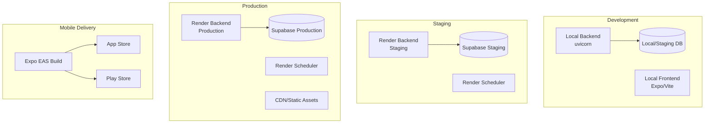
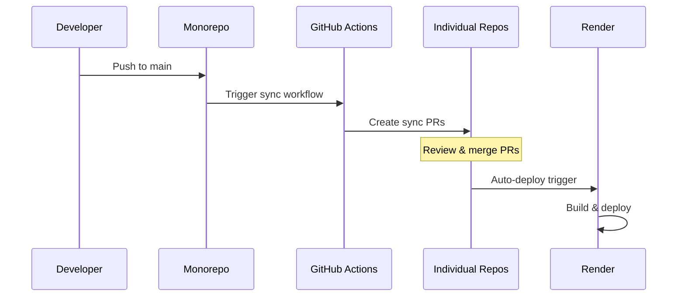

# Deployment & Environments

This document covers the deployment process, environment configuration, and infrastructure setup for the PinnacleSG platform.

## Environment Overview

| Environment | Purpose | Backend URL | Admin URL |
|-------------|---------|-------------|-----------|
| Development | Local development | `localhost:8000` | `localhost:5173` |
| Staging | Testing & QA | `pinnacle-api.geddit-apps.com` | `admin-staging.pinnacle.com` |
| Production | Live users | `pinnaclesg-api.pinnaclefamilyclinic.com.sg` | `admin.pinnaclefamilyclinic.com.sg` |

## Infrastructure Architecture



## Deployment Flow

### Monorepo to Individual Repos



### Backend Deployment

1. **Push to monorepo** (`main` branch)
2. **GitHub Actions** syncs to `backend-patient-app` repo
3. **Render** detects changes and auto-deploys
4. **Health check** confirms deployment

### Frontend Web Deployment

1. **Push to monorepo** (`main` branch)
2. **GitHub Actions** syncs to `frontend-admin-web-ui` repo
3. **Render** builds static assets
4. **Deploy** to CDN

### Mobile App Deployment

1. **Update version** in `app.config.js`
2. **Build with EAS**: `eas build --platform all`
3. **Submit to stores**: `eas submit`
4. **OTA updates**: `eas update` for minor updates

---

## Backend Deployment

### Render Configuration

**render.yaml:**
```yaml
services:
  - type: web
    name: pinnacle-api
    env: python
    buildCommand: pip install -r requirements.txt
    startCommand: uvicorn main:app --host 0.0.0.0 --port $PORT
    envVars:
      - key: BACKEND_ENVIRONMENT
        value: production
      - key: POSTGRES_URL
        fromDatabase:
          name: pinnacle-db
          property: connectionString
    healthCheckPath: /api/render/health
    autoDeploy: true

  - type: worker
    name: pinnacle-scheduler
    env: python
    buildCommand: pip install -r requirements.txt
    startCommand: python scheduler.py
    envVars:
      - key: BACKEND_ENVIRONMENT
        value: production
```

### Health Check Endpoint

```python
# routers/render.py
@router.get("/health")
async def health_check():
    return {"status": "healthy", "timestamp": datetime.now().isoformat()}
```

### Zero-Downtime Deployment

Render handles rolling deployments automatically:
1. New instance starts
2. Health check passes
3. Traffic shifts to new instance
4. Old instance terminates

---

## Frontend Web Deployment

### Build Process

```bash
cd frontend-admin-web-ui

# Production build
pnpm build

# Output directory
ls dist/
```

### Environment Variables

```bash
# .env.production
VITE_ADMIN_API_URL=https://pinnaclesg-api.pinnaclefamilyclinic.com.sg
VITE_ENV=production
```

### Static Site Configuration

**vite.config.ts:**
```typescript
export default defineConfig({
  build: {
    outDir: 'dist',
    sourcemap: false,
  },
  // Production optimizations
  esbuild: {
    drop: ['console', 'debugger'],
  },
});
```

---

## Mobile App Deployment

### EAS Build Configuration

**eas.json:**
```json
{
  "cli": {
    "version": ">= 3.0.0"
  },
  "build": {
    "development": {
      "developmentClient": true,
      "distribution": "internal"
    },
    "preview": {
      "distribution": "internal",
      "android": {
        "buildType": "apk"
      }
    },
    "production": {
      "autoIncrement": true
    }
  },
  "submit": {
    "production": {
      "ios": {
        "appleId": "developer@pinnacle.com",
        "ascAppId": "1234567890"
      },
      "android": {
        "serviceAccountKeyPath": "./google-service-account.json"
      }
    }
  }
}
```

### Build Commands

```bash
# Development build (internal testing)
eas build --profile development --platform all

# Preview build (beta testing)
eas build --profile preview --platform all

# Production build
eas build --profile production --platform all

# Submit to stores
eas submit --platform all
```

### OTA Updates

For JavaScript-only changes:

```bash
# Create update
eas update --branch production --message "Bug fix"

# Check update status
eas update:list
```

---

## Secrets Management

### Infisical Setup

All secrets are managed through Infisical - never stored in `.env` files.

```bash
# Login to Infisical
infisical login

# Run with secrets
infisical run --env=staging -- uvicorn main:app --reload
infisical run --env=production -- uvicorn main:app
```

### Environment-Specific Secrets

| Secret | Development | Staging | Production |
|--------|-------------|---------|------------|
| `POSTGRES_URL` | Local/Staging | Staging DB | Production DB |
| `STRIPE_SECRET_KEY` | Test key | Test key | Live key |
| `FIREBASE_*` | Same project | Same project | Same project |
| `SGIMED_API_KEY` | Sandbox | Sandbox | Production |

### Adding New Secrets

1. Login to [Infisical](https://app.infisical.com/)
2. Navigate to project workspace
3. Add secret for each environment
4. Reference in code via `os.getenv("SECRET_NAME")`

---

## Database Migrations

### Development

```bash
cd backend-patient-app

# Create migration
uv run alembic revision --autogenerate -m "Add new column"

# Apply migration locally (staging DB)
infisical run --env=staging -- uv run alembic upgrade head
```

### Production

```bash
# Review migration first
uv run alembic upgrade head --sql > migration.sql

# Apply to production
infisical run --env=production -- uv run alembic upgrade head
```

### Rollback

```bash
# Rollback one version
infisical run --env=production -- uv run alembic downgrade -1

# Rollback to specific version
infisical run --env=production -- uv run alembic downgrade <revision>
```

---

## Monitoring & Alerts

### Sentry Integration

**Backend:**
```python
import sentry_sdk
sentry_sdk.init(
    dsn=SENTRY_DSN,
    environment=BACKEND_ENVIRONMENT,
    traces_sample_rate=0.1,
)
```

**Frontend:**
```typescript
Sentry.init({
  dsn: SENTRY_DSN,
  environment: 'production',
  tracesSampleRate: 0.1,
});
```

### Health Monitoring

| Check | Frequency | Alert Threshold |
|-------|-----------|-----------------|
| API Health | 1 min | 3 failures |
| Database | 5 min | 1 failure |
| Scheduler | 10 min | 2 failures |
| Memory | 5 min | >90% usage |

### Render Dashboard

Monitor via Render dashboard:
- Request metrics
- Response times
- Error rates
- Resource usage

---

## Rollback Procedures

### Backend Rollback

1. **Via Render Dashboard:**
   - Go to service → Deploys
   - Click "Rollback" on previous deploy

2. **Via Git:**
   ```bash
   git revert HEAD
   git push origin main
   ```

### Mobile App Rollback

For OTA updates:
```bash
# Rollback to previous update
eas update:rollback --branch production
```

For native changes:
- Submit new build with fixes
- Request expedited review if critical

---

## Environment Configuration Reference

### Backend (`config.py`)

```python
# Core
BACKEND_ENVIRONMENT = os.getenv("BACKEND_ENVIRONMENT", "development")
BACKEND_API_URL = os.getenv("BACKEND_API_URL")

# Database
POSTGRES_URL = os.getenv("POSTGRES_URL")
POSTGRES_POOL_SIZE = int(os.getenv("POSTGRES_POOL_SIZE", "40"))

# Redis
REDIS_HOST = os.getenv("REDIS_HOST", "localhost")
REDIS_PORT = int(os.getenv("REDIS_PORT", "6379"))

# Feature Flags
ENABLE_WEBHOOKS = os.getenv("ENABLE_WEBHOOKS", "true") == "true"
```

### Frontend Patient App (`Config.ts`)

```typescript
const environments = {
  production: {
    apiUrl: 'https://pinnaclesg-api.pinnaclefamilyclinic.com.sg',
    stripePublishableKey: 'pk_live_...',
    environment: 'production',
  },
  development: {
    apiUrl: 'https://pinnacle-api.geddit-apps.com',
    stripePublishableKey: 'pk_test_...',
    environment: 'staging',
  },
};

export default __DEV__ ? environments.development : environments.production;
```

### Frontend Admin (`vite.config.ts`)

```typescript
export default defineConfig({
  define: {
    'import.meta.env.VITE_API_URL': JSON.stringify(
      process.env.VITE_API_URL || 'http://localhost:8000'
    ),
  },
});
```

---

## Deployment Checklist

### Pre-Deployment

- [ ] All tests pass
- [ ] Code reviewed and approved
- [ ] Migration tested on staging
- [ ] Secrets configured in Infisical
- [ ] Release notes prepared

### Deployment

- [ ] Merge to main branch
- [ ] Monitor sync to individual repos
- [ ] Verify Render deployment starts
- [ ] Watch deployment logs

### Post-Deployment

- [ ] Verify health check passes
- [ ] Check Sentry for new errors
- [ ] Smoke test critical flows
- [ ] Monitor metrics for anomalies
- [ ] Update release notes

---

**Last Updated**: 2026-01-16
